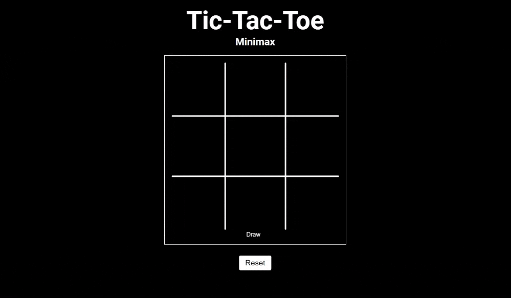

# TicTacToe-MiniMax

This project is an implementation of the classic Tic-Tac-Toe game using the MiniMax algorithm. The MiniMax algorithm is used to create an AI opponent that plays optimally, making it a challenging for users.

- **Language**: JavaScript
- **Library**: p5.js

Enjoy playing against an unbeatable AI!

## Showcase

